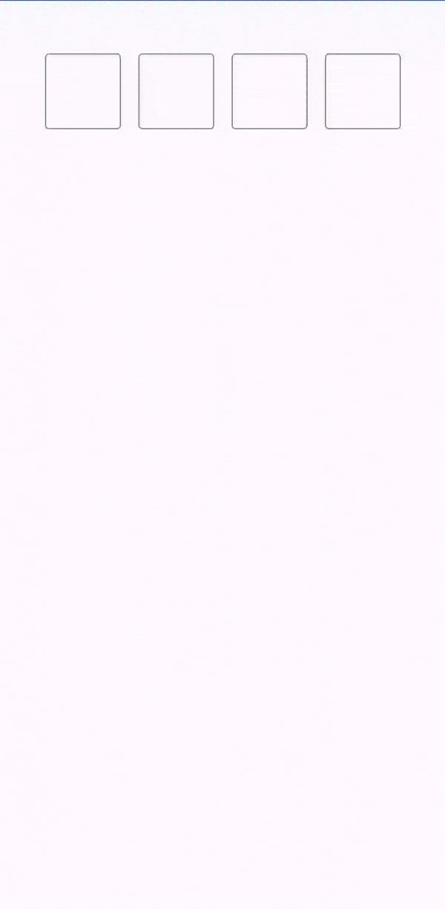
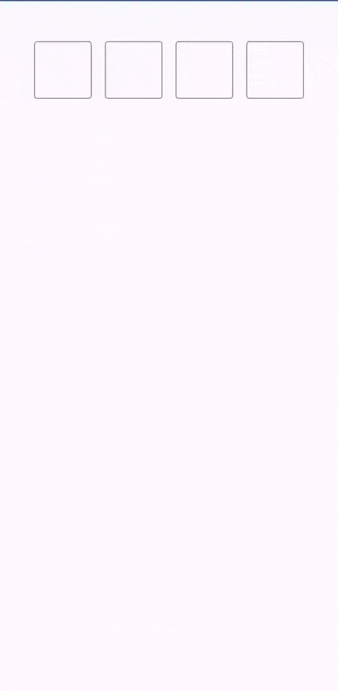
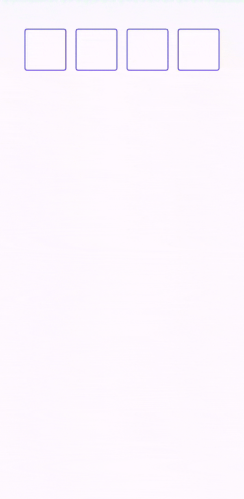
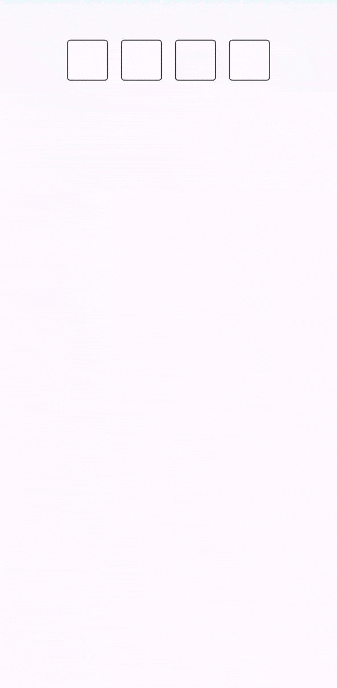

## Android 프로젝트 구조

이 프로젝트는 안드로이드의 **멀티 모듈 아키텍처(Multi-module Architecture)** 를 따르고 있으며,
각 모듈은 다음과 같은 명확한 역할을 수행합니다.

| 모듈명                | 역할                                                                                                                            | 비유              |
| --------------------- | ------------------------------------------------------------------------------------------------------------------------------- | ----------------- |
| **`app`**             | 최종 사용자가 설치하는 **애플리케이션**입니다.`PinTextFieldLib`를 가져와 실제 화면에 구현합니다.                                | 완성된 자동차     |
| **`PinTextFieldLib`** | PIN 입력 UI 컴포넌트를 제공하는 **재사용 가능한 라이브러리**입니다. 독립적으로 존재하며 다른 프로젝트에서도 사용할 수 있습니다. | 자동차 부품(엔진) |
| **`Gradle Scripts`**  | 프로젝트의 빌드 방식과 모듈 간의 의존성을 정의하는 **설계도** 역할을 합니다.                                                    | 조립 설명서       |

### 📂 app, PinTextFieldLib 모듈 상세 구조

* `manifests`: 애플리케이션의 '신분증' 또는 '설정 요약'과 같은 역할을 합니다. 안드로이드 OS나 Google Play Store가 앱을 실행하거나 정보를 파악하기 위해 반드시 필요한 필수 정보를 담고 있습니다.
* `kotlin+java`: 애플리케이션의 '두뇌'에 해당합니다. 앱의 모든 로직, 즉 '어떻게 동작할 것인가'를 정의하는 Kotlin 또는 Java 코드가 위치합니다.
* `res`: 애플리케이션의 '외형'과 '자료'를 담당합니다. 코드(로직)와 UI 리소스(데이터)를 분리하여 관리의 효율성을 높입니다. 예를 들어, 앱의 텍스트를 수정할 때 코드를 건드리지 않고 `res/values/strings.xml`만 수정하면 되므로 유지보수가 용이해집니다. `PinTextFieldLib` 모듈에는 존재하지 않습니다.
* `res (generated)`: `이 폴더는 개발자가 직접 수정하는 곳이 아닙니다.` 안드로이드 빌드 시스템이 프로젝트를 컴파일하는 과정에서 자동으로 생성하는 리소스 파일들이 위치하는 곳입니다.

# @remarks

# 하단부터 수정 예정

---

# ComposePinInput - Jetpack Compose PIN 번호 입력 라이브러리

머티리얼 디자인 3원칙(Material Design 3 principles)을 사용하여 Kotlin과 Jetpack Compose로 빌드된
Android용 `ComposePinInput` 라이브러리에 오신 것을 환영합니다. 이 사용자가 지정 가능한 다목적
라이브러리를 사용하면 핀 코드, OTP 또는 비밀번호 입력에 이상적인 핀 입력 필드를 작성 UI에 쉽게
통합할 수 있습니다.

아래 GIF는 실제 애플리케이션을 사용하는 상황에서 `ComposePinInput`을 보여줍니다. GIF를 따라가면
Jetpack Compose를 사용하여 이 기능을 구현하는 방법을 보여주는 예제 코드를 확인할 수 있습니다.



`ComposePinInput`을 Jetpack Compose 레이아웃에서 사용하는 방법은 직관적입니다. 아래 예시는 기본
설정을 보여줍니다. 이 설정에서는 입력된 핀의 상태를 유지하는 `Preview` composable 함수를 정의합니다.
composable 함수인 `ComposePinInput`은 현재 `pin`값, 값 변경을 처리하는 람다, 핀이 완전히 입력됐을 때
수행할 액션을 취합니다. 또한 셀 크기를 사용자가 지정하고 미리 정의된 스타일(예: 각 숫자 주위 박스)을
적용할 수 있습니다.

```kotlin
@Composable
fun Preview() {
    // 입력된 핀(PIN) 값을 저장하기 위한 state 변수
    var pin by remember { mutableStateOf("") }

    // 토스트(사용자에게 잠시 보여지고 사라지는 팝업) 메시지를 표시하기 위한 로컬 문맥 객체
    val context = LocalContext.current

    ComposePinInput(
        value = pin,
        onValueChange = {
            pin = it // 값이 변경되었을 때, state 변수 업데이트
        },
        cellSize = 70.dp, // 각 셀의 크기(높이, 너비)
        onPinEntered = { // PIN이 입력된 것을 알릴 때, 
            Toast.makeText(context, "$it", Toast.LENGTH_SHORT).show()
        },
        style = ComposePinInputStyle.BOX
    )
}
```

## Input Masking with Asterisks

Here is a version that masks the input, displaying asterisks (*) instead of the actual characters as
the user types:



```kotlin
@Composable
fun Preview() {
    // State to hold the value of the pin
    var pin by remember { mutableStateOf("") }

    // Local context to show a toast message
    val context = LocalContext.current

    ComposePinInput(
        value = pin,
        mask = '*', // Masks the input with asterisks
        onValueChange = {
            pin = it
        },
        cellSize = 70.dp,
        onPinEntered = {
            Toast.makeText(context, "$it", Toast.LENGTH_SHORT).show()
        },

        style = ComposePinInputStyle.BOX
    )
}
```

## Custom Cell Border Colors

Enhance the visual appeal of your `ComposePinInput` by customizing the cell border colors, including
the color change when a cell is focused:



```kotlin
@Composable
fun Preview() {
    var pin by remember { mutableStateOf("") }
    val context = LocalContext.current

    ComposePinInput(
        value = pin,
        mask = '*',
        cellBorderColor = Color.Blue, // Just pass the color here for the cell/box border
        focusedCellBorderColor = Color.Magenta, // when the box is focused it's color can be customized here
        onValueChange = {
            pin = it
        },
        cellSize = 70.dp,
        onPinEntered = {
            Toast.makeText(context, "$it", Toast.LENGTH_SHORT).show()
        },

        style = ComposePinInputStyle.BOX
    )
}
```

# Underline Style Customization

You can change the shape of `ComposePinInput` instead of Boxes simple underlines are also supported
For a subtler look, `ComposePinInput` supports an underline style instead of boxes. The following
example demonstrates this style:


```kotlin
@Composable
fun Preview() {
    var pin by remember { mutableStateOf("") }
    val context = LocalContext.current

    // Underline style with custom border colors
    ComposePinInput(
        value = pin,
        mask = '*',
        cellBorderColor = Color.DarkGray, // Just pass the color here for the cell/box border
        focusedCellBorderColor = Color.Blue, // when the box is focused it's color can be customized here
        onValueChange = {
            pin = it
        },
        cellSize = 70.dp,
        onPinEntered = {
            Toast.makeText(context, "$it", Toast.LENGTH_SHORT).show()
        },

        style = ComposePinInputStyle.UNDERLINE // Apply the underline style
    )
}
```

# Dynamic Background and Font Colors

Customize the on focus background color and font color



```kotlin
@Composable
fun Preview() {
    var pin by remember { mutableStateOf("") }
    val context = LocalContext.current

    // Box style with dynamic background and font colors
    ComposePinInput(
        value = pin,
        mask = '*',
        cellBorderColor = Color.DarkGray, // Just pass the color here for the cell/box border
        focusedCellBorderColor = Color.Blue, // when the box is focused it's color can be customized here
        cellColorOnSelect = Color.Cyan // This will change the color once focus is on the cell
                fontColor = Color . Blue, // This is how font color can be changed
        onValueChange = {
            pin = it
        },
        cellSize = 70.dp,
        onPinEntered = {
            Toast.makeText(context, "$it", Toast.LENGTH_SHORT).show()
        },

        style = ComposePinInputStyle.BOX // // Retaining the box style
    )
}
```

# Flexibility in Number of Cells and Mask Character

`ComposePinInput` is highly flexible, allowing you to define the number of cells and choose a custom
mask character, as illustrated below:


```kotlin
@Composable
fun Preview() {
    var pin by remember { mutableStateOf("") }
    val context = LocalContext.current

    // Custom number of cells and mask character
    ComposePinInput(
        value = pin,
        mask = '⚫', // // Choose any character as the mask
        maxSize = 6, // // Define the number of cells, 4 are default if this property is not used
        cellSize = 45.dp, // default size is 50.dp, this property is optional
        onValueChange = {
            pin = it
        },
        onPinEntered = {
            Toast.makeText(context, "$it", Toast.LENGTH_SHORT).show()
        },

        style = ComposePinInputStyle.BOX // // Using the box style
    )
}
```

# How to Use

To use [Library Name], follow these steps:

## Installation

### Gradle Setup

1. **Add the JitPack repository to your build file, if not already added**

   Add the following in your root `build.gradle` at the end of repositories:

   ```gradle
   allprojects {
     repositories {
       ...
       maven { url 'https://jitpack.io' }
     }
   }
   ```
   **Or if you're using build.gradle.kts:**
   ```gradle
   allprojects {
      repositories {
    ...
        maven(url = "https://jitpack.io")
      }
    }
   ```
2. **Add the dependency**
   ```gradle
   dependencies {
      implementation 'com.github.sharp-edge:ComposePinInput:1.0.3'
    }
   ```
   **for build.gradle.kts:**
   ```gradle
   dependencies {
      implementation ("com.github.sharp-edge:ComposePinInput:1.0.3")
    }
   ```

## Known Issues

As of the current version, the library has the following known limitation:

- **Theme Support**: The `ComposePinInput` component does not currently support centralized theme
  management. This means it does not automatically adopt colors, fonts, and other styling properties
  from the app's theme.

    - *Impact*: All parameters for color, font size, and other styling must be explicitly passed to
      the component; it will not inherit these from the app's theme settings.
    - *Status*: This is a known design limitation in the current release. Future versions may
      include improved theme support.

We welcome contributions and suggestions on how to enhance theming capabilities. If you have ideas
or solutions, please share them by opening
an [issue](https://github.com/sharp-edge/ComposePinInput/issues) or submitting a pull request.

Please report any new issues you encounter, and I will aim to address them in subsequent releases.

## Bugs and Issues

If you encounter any bugs or issues with this library, please report them in
the [Issues](https://github.com/sharp-edge/ComposePinInput/issues) section of the repository. Before
creating a new issue, please check to see if a similar issue has already been reported by another
user.

When reporting an issue, try to include as much information as possible about the environment where
the bug occurred, steps to reproduce the issue, expected behavior, and any other information that
might help us resolve the problem. Screenshots or code snippets can also be very helpful.

## 라이센스

This project is licensed under the Apache License 2.0 - see the [LICENSE](LICENSE) file for details.

   
